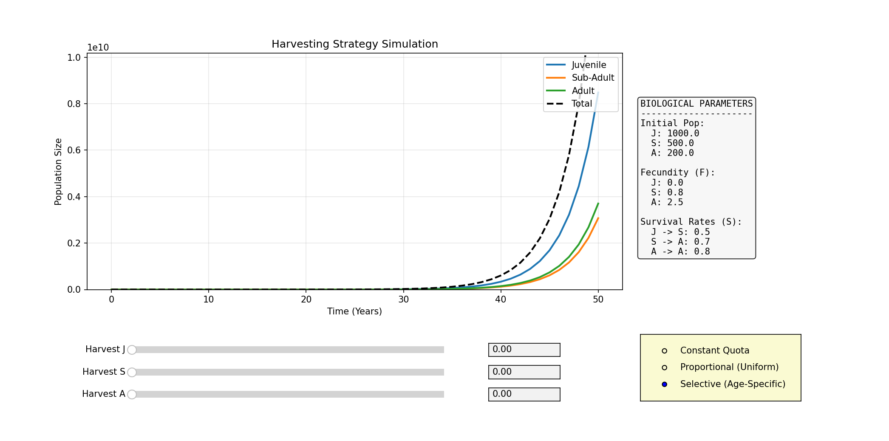

# Population Harvesting Strategy Simulation
This project was developed as a term project for class MAT263E at Istanbul Technical University.

## Installation
You need python3 alongside numpy and matplotlib libraries.
```bash
python3 -m pip install matplotlib numpy
```

## Usage
1. Clone this repository or copy the script.
2. Run the command below.
```bash
python3 harvesting.py
```

## Interface

* You can see the biological parameters used in the simulation on the right side of the interface. These values are not editable on the interface, you need to edit them in the python code itself.
* There are 3 sliders and textboxes located at the bottom. These represent different values for all 3 harvesting methods (J = Juvenile, S = Sub-Adult, A = Adult). You can edit these sliders and see the calculation in real time.
* On the bottom right, you can toggle between 3 harvesting methods.
    * **Selective:** Each slider represents percentage of that age group that will be harvested in a year.
    * **Proportional:** Only one slider is available. That represents the percentage of population that will be harvested, regardless of age.
    * **Constant Quota:** Each slider represents the exact number of individual animals in an age group that will be harvested every year.

## Real-Time Simulation Mode

For a more hands on experience, run the real-time simulation:

```bash
python realtime_simulation.py
```
### New Controls:
* Play/Pause: Toggle the passage of time.
* Speed Slider: Control how fast years pass (Frames Per Second).
* Reset: Restart the population from year 0.